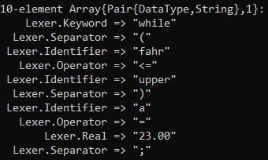

# ratCompiler
A RAT21F Compiler written in Julia utilizing multiple dispatch FSM's

This lexical analyzer is capable of reading input from a .rat file and returning Token -> Lexeme pairings. The lexer is capable of handling a wide variety of inputs from potential source files.

###### Sample Input
```
while  (fahr <= upper)   a = 23.00;  /* this is a sample comment */
```
###### Output

